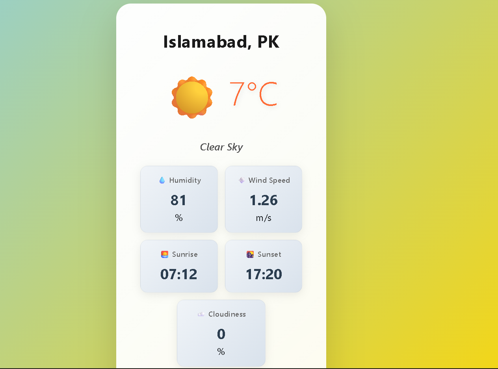

# Weather App - Internee.pk Internship Task 2

A responsive, real-time weather application built as part of the HTML/CSS/JS Virtual Internship at Internee.pk (January 9, 2026 - March 9, 2026). This project demonstrates core frontend skills by fetching and displaying weather data from an external API, with features like user input handling, dynamic UI updates, error management, geolocation integration, and adaptive styling.

The app allows users to search for weather by city name or automatically detects their location for instant results. It emphasizes clean code, best practices (e.g., semantic HTML, modular CSS, async JS), and user-friendly design, aligning with the internship's focus on hands-on learning and innovation.

## Features

*City Search*:
Users can enter a city name (e.g., "Bannu" or "Abbottabad") to fetch current weather details instantly.

*Weather Data Display*:
 Shows temperature (in °C), humidity (%), wind speed (m/s), and weather conditions (e.g., "Clear Sky") with descriptive text.

*Dynamic Icons*:
 Displays appropriate emojis/icons based on weather conditions (e.g., ☀️ for sunny, 🌧️ for rainy, ☁️ for cloudy).

*Error Handling*:
Gracefully manages invalid city names, API errors, or network issues with user-friendly messages (e.g., "City not found").

*Geolocation Auto-Detect*
 Uses the browser's Geolocation API to automatically retrieve and display weather for the user's current location (with permission prompt and fallback to manual input).
 
*Dynamic Background*
 Changes the app's background gradient or image based on weather conditions (e.g., yellow for sunny, blue for rainy, gray for cloudy) for an immersive experience.

*Loading Indicator*
 Shows a "Loading..." message during API calls to improve UX.

*Responsive Design*
 Fully mobile-friendly layout using CSS media queries, ensuring seamless viewing on desktops, tablets, and phones.

*Accessibility*
 Semantic HTML elements, alt text for icons (if images used), and keyboard navigation support.

*Performance Optimizations*
 Asynchronous API calls with `fetch()`, minimal DOM manipulations, and lightweight code for fast loading.

# Technologies Used

**HTML5**
 For semantic structure and form elements.
**CSS3**
 For styling, gradients, transitions, and responsive layouts (including Flexbox/Grid if implemented).
**JavaScript (ES6+)**
 For API integration (`fetch()`), DOM manipulation, event handling, async operations, and geolocation.
**API**
OpenWeatherMap (free tier) for weather data — replaceable with alternatives like Weatherbit or AccuWeather via RapidAPI.

**Fonts**
 Google Fonts (Roboto) for modern typography.
**Tools** 
VS Code for development, Git/GitHub for version control.

No external libraries or frameworks (e.g., React) were used to keep it vanilla and focused on core skills.

## Installation & Setup

1. *Clone the Repository*:
   
   git clone https://https://github.com/nominewgit-hub/Weather-App

2. *Navigate to the Project Folder*
   
   cd weather-app-internee-task2
   
3. *Add Your API Key*
   - Sign up for a free API key at [OpenWeatherMap](https://openweathermap.org/api).
   - Open `Scripts/Scripts.js` (or your JS file) and replace `'YOUR_API_KEY'` with your actual key.

4. **Run Locally**:
   - Open `index.html` in any modern browser (e.g., Chrome, Firefox).
   - Or use a local server like VS Code's Live Server extension for better testing.

No additional dependencies or installations required — runs purely on client-side.

## Usage

1. Open the app in your browser.
2. Allow location access when prompted (for auto-detect) or enter a city name in the search box.
3. Click "Search" to fetch data.
4. View real-time weather info with icons and dynamic background.
5. If an error occurs (e.g., invalid city), a message will appear — try again with a valid input.

## Live Demo

[View Live on GitHub Pages](https://nominewgit-hub.github.io/Weather-App/)  

Alternatively, deploy to Netlify or Vercel for free:
- Connect your GitHub repo.
- Build command: none (static site).
- Output directory: / (root).

## Screenshots

- **Home/Search View**:  
   
  

- **Weather Results**:  
  

## Challenges & Learnings

- Integrated `fetch()` for API calls and handled JSON responses asynchronously.
- Used Geolocation API with permission/error handling for user privacy.
- Implemented dynamic DOM updates and CSS class toggles for backgrounds.
- Ensured cross-browser compatibility and mobile responsiveness.
- Aligned with Internee.pk roadmap: Focused on JS basics (async/await, events), HTML structure, and CSS layouts.

This project enhanced my understanding of real-world API integration and UX improvements.

## Contributing

Feel free to fork and submit pull requests for improvements (e.g., add forecast feature or unit toggle °C/°F). Issues welcome for bugs or suggestions.

## License

MIT License — Free to use, modify, and distribute. 

## Author

Built by *Muhammad Noman* Khyber Pakhtunkhwa, Pakistan.  
- LinkedIn: [Muhammad Noman](https://www.linkedin.com/in/muhammad-noman-muhammad-noman-638934335/)  
- GitHub: [YOUR_USERNAME](https://github.com/nominewgit-hub)  
- Location: Bannu, PK  
- Internship: Internee.pk HTML/CSS/JS (Jan-Mar 2026)  

#InterneePk #WebDevelopment #Frontend #HTMLCSSJS #WeatherApp #OpenSource

